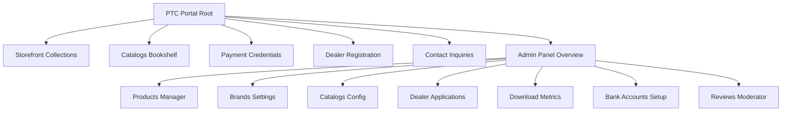
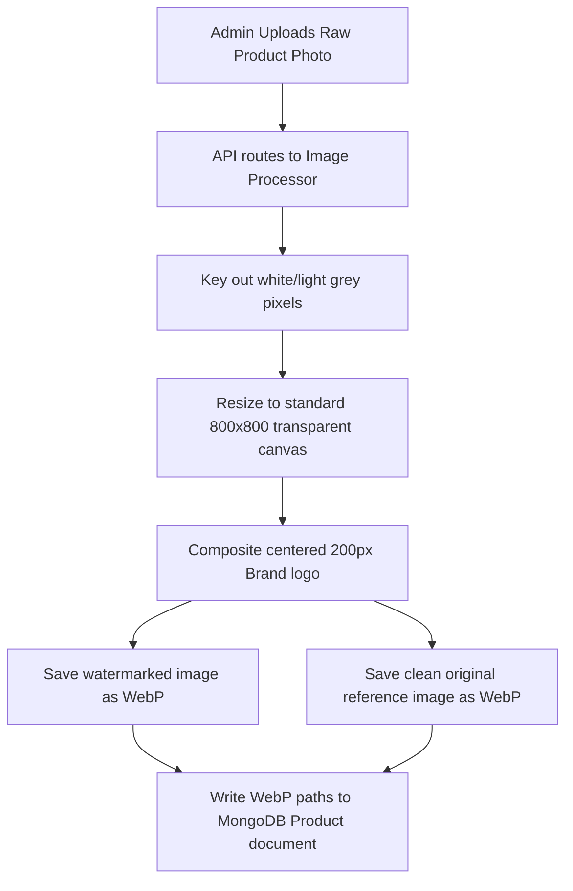
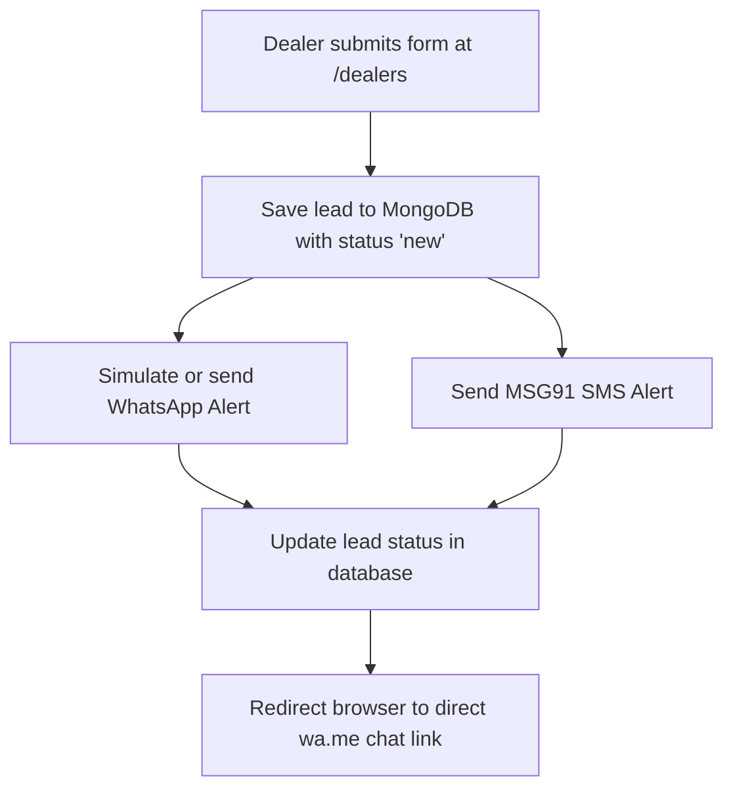
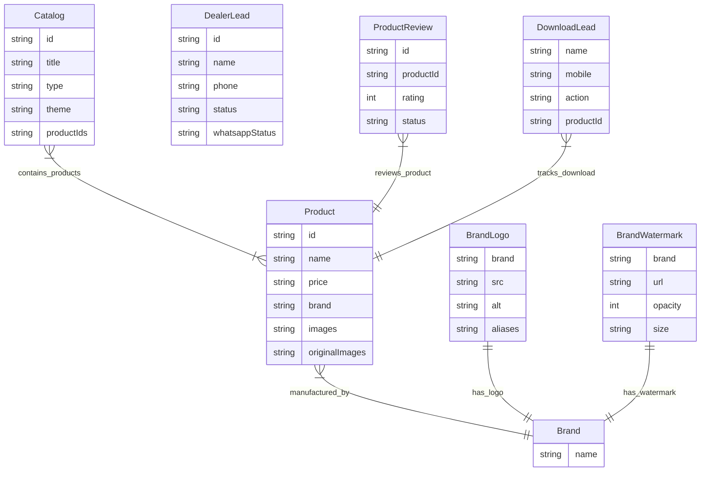

# PTC Furnitures - Professional Project Documentation & User Guide

This document serves as the operational guide and system reference for the PTC Furnitures Storefront and Administration Platform. It explains how to navigate the system, how to perform core business tasks, and what data the platform holds.

---

## 🧭 System Navigation Map

The application consists of two main sections: the **Public Storefront** (for clients and dealers) and the **Admin Dashboard** (for business operations).

### 1. Public Storefront Navigation
- **Home Page (`/`)**: Brand introduction, featured collections, and navigation links.
- **Product Collections (`/collections`)**: The primary browsing catalog. 
  - Allows filtering by manufacturer brand names (e.g., PTC GOLD, REX, ALTECH).
  - Supports sorting by newest arrivals.
  - Hovering over a product displays additional photos, product materials, custom dimensions, and action buttons.
- **Dealers Portal (`/dealers`)**: A partner registration page available in both English and Hindi. Retailers use this portal to apply for partnership benefits, wholesale pricing, and showroom credits.
- **Payment & Bank Info (`/payment`)**: Displays the business's active corporate bank transfer accounts, IFSC codes, and UPI details. Users can download payment QR codes directly from this screen.
- **Catalogs Bookshelf (`/catalogs` & `/catalogs/[id]`)**: Displays pre-configured product catalog brochures. Users can print brochures, view collections online, or download PDF catalogs.
- **Contact Page (`/contact`)**: General inquiry form for retail or logistics questions.

### 2. Admin Dashboard Navigation
Accessible via the `/admin` path, the dashboard provides a shell with sidebar links to the following operational sections:
- **Overview Hub (`/admin`)**: Interactive cards displaying real-time metrics (Total catalog items, active brands, image assets count, and database status).
- **Products Manager (`/admin/products`)**: The inventory workspace. Admin can add new products, edit specifications, delete items, and configure dynamic custom fields.
- **Brands Directory (`/admin/brands`)**: Manage brand names, upload manufacturer logos, match aliases, and set watermark transparency rules.
- **Brochure Catalogs (`/admin/catalogs`)**: Create and organize custom product catalogs. Admin can choose between attaching a PDF brochure or compiling a custom theme-based HTML catalog (`minimal`, `gold`, `dark`).
- **Partner Leads (`/admin/leads`)**: View and manage dealer applications. Admins can update application statuses (New, Contacted, Approved, Rejected) and review WhatsApp notification history.
- **Download Analytics (`/admin/download-leads`)**: Displays list of prospects who downloaded product photos, printed catalogs, or saved brochures.
- **Customer Reviews (`/admin/reviews`)**: Moderation dashboard to approve, hold, or reject product reviews.
- **Banking Settings (`/admin/settings` or `/admin/banking`)**: Register new corporate banking coordinates and UPI QR codes, toggling which accounts are visible on the public payment screen.

---

## ⚙️ How to Use the Project (Operational Guide)

### 1. Product Upload & Image Pipeline Workflow
When a product image is uploaded, it passes through the following automated server processing stages:

### 2. Partner Registration & Notification Flow
When a dealer submits an inquiry form, the system routes notifications across multiple channels:

### Operational Steps for Storefront Customers & Prospective Dealers
1. **Browsing & Downloading:**
   - Browse the catalog under `/collections`.
   - When hovering over a product, click the **Download Image** button. A form will prompt for your name and mobile number to capture interest metrics before initiating the high-definition image save.
2. **Registering as a Partner Dealer:**
   - Go to `/dealers` (select English or Hindi using the language switcher).
   - Fill out your Name, Phone Number, City, and Email, then click **Submit**.
   - Upon submission, the portal logs your lead, launches the automated WhatsApp notification, and opens a direct WhatsApp link pre-filled with your reference ID to immediately notify the sales desk.
3. **Settling Payments:**
   - Visit the `/payment` page to review verified account transfer credentials.
   - Scan or download the active QR code, make the payment, and copy down the transaction details for reference.

### Operational Steps for Platform Administrators
1. **Adding a Product:**
   - Go to `/admin/products` and click **Add Product**.
   - Select the associated brand, enter details (Price, Material, Crafted By, Tags).
   - *Optional:* Add custom specifications by defining custom metadata rows (e.g., Label: `Width`, Value: `45 inches`).
   - Drag and drop or upload a product photo.
2. **Managing Brand Watermarks:**
   - In `/admin/brands`, configure logos and transparency settings for each brand.
   - Changing a brand's logo or opacity automatically triggers a background script that updates the watermark for all existing products belonging to that brand.
3. **Creating a Custom Catalog:**
   - Go to `/admin/catalogs` and click **Create Catalog**.
   - Choose a layout type:
     - **PDF Brochure:** Upload a file and name the catalog.
     - **Custom Collection:** Select a stylesheet theme (`Minimalist White`, `Elegant Gold`, or `Sleek Dark`), filter by brand, select the products to include, and hit Save.
4. **Processing Dealer Applications:**
   - Check `/admin/leads` to view new registrants.
   - Use the dropdown action menu to change a dealer's status from **New** to **Contacted** or **Approved**.
   - Review the WhatsApp status column to verify if the server's simulated notifications successfully dispatched to the applicant.
5. **Updating Bank Details:**
   - In `/admin/banking`, register your corporate accounts.
   - Toggle the **Active** switch on your primary account to immediately update the public `/payment` page coordinates.

---

## 📊 What Data the Platform Holds

The system runs on a structured MongoDB database consisting of 12 distinct data stores:

### 1. Core Inventory Data
- **Products (`Product` collection)**:
  - Product identifiers, names, prices, construction materials, makers, tags.
  - Image URLs pointing to watermarked versions and clean reference copies.
  - Key-value metadata specifications.
- **Brand Registry (`Brand` collection)**:
  - List of active manufacturer brand names.
- **Brand Logos (`BrandLogo` collection)**:
  - Brand logo paths, image alt text, and spelling aliases.
- **Watermark Settings (`BrandWatermark` collection)**:
  - Watermark URLs, size classes, opacity scale factors (0-100), and display positioning variables.

### 2. Marketing & Leads Data
- **Brochure Catalogs (`Catalog` collection)**:
  - Catalog titles, descriptions, theme types (`pdf` / `custom`), PDF files, and list of included product references.
- **Dealer Applications (`DealerLead` collection)**:
  - Dealer name, contact numbers, city coordinates, email addresses, submission timestamps.
  - Verification logs: status flags, WhatsApp delivery logs, message text, and timestamp details.
- **Download Interactions (`DownloadLead` collection)**:
  - Tracks user details (name, mobile) linked to specific actions (brochure download, print event, individual product image save) and product references.
- **Product Reviews (`ProductReview` collection)**:
  - Product reference, rating scores (1-5 stars), text feedback, submission dates, and moderation status flags.
- **Contact Forms (`ContactMessage` collection)**:
  - Names, mobile numbers, subject headers, and body text submitted via contact forms.

### 3. Financial & System Cache Data
- **Bank Credentials (`BankingDetails` collection)**:
  - Account labels, status toggles, bank names, account numbers, IFSC codes, account types, UPI handles, QR code images, and notes.
- **Background Removal Cache (`BgRemovedCache` collection)**:
  - Speeds up future edits by mapping original product image URLs directly to background-stripped transparent versions.
- **System Media (`StoredFile` collection)**:
  - Binary database buffer storage for dynamic uploads (e.g., brand logos, custom QR codes).
