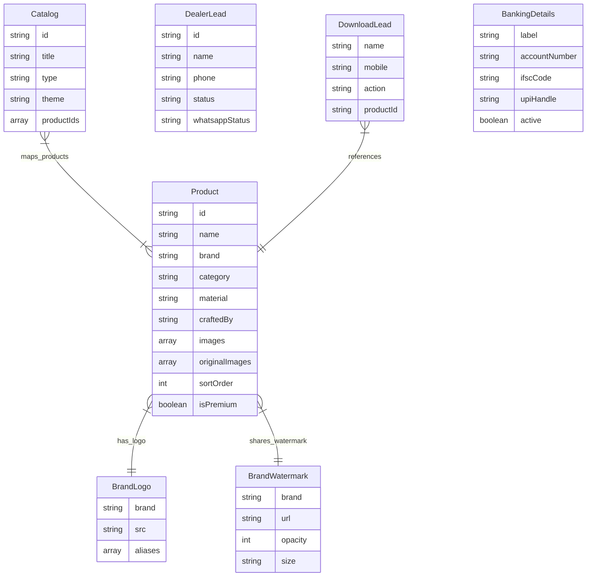
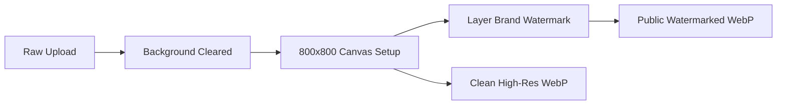

# PTC Furnitures - Comprehensive System & Operational Guide

Welcome to the comprehensive system guide for **PTC Furnitures**. This document serves as the ultimate technical and operational manual for developers, admins, and designers managing the codebase and platform.

---

## 🧭 System Map

The application is split into two distinct functional zones:
1. **Public Storefront** — Highly responsive client-facing portal optimized for portfolio discovery, brochure downloads, and dealer conversions.
2. **Admin Dashboard** — Fully authenticated management suite for catalog control, inventory layout, brand assets, and partner inquiries.

```mermaid
graph TD
    Root[PTC Furnitures Root]
    
    Root --> Storefront[Public Storefront]
    Storefront --> Collections[/collections - Catalog Grid]
    Storefront --> Catalogs[/catalogs - Bookshelf & Dynamic Themes]
    Storefront --> Dealers[/dealers - Partner Signups]
    Storefront --> Payment[/payment - Banking Credentials]
    Storefront --> Contact[/contact - Inquiry Forms]

    Root --> Admin[Admin Suite /admin]
    Admin --> AdminProd[Products Workspace]
    Admin --> AdminPrem[Homepage Premium Customizer]
    Admin --> AdminCatalog[Brochure Composer]
    Admin --> AdminLeads[Partner Leads Tracker]
    Admin --> AdminReviews[Reviews Moderator]
    Admin --> AdminBanking[Bank Details Config]
    Admin --> AdminBrand[Brand Asset & Watermarks Settings]
    Admin --> AdminDownload[Metrics & Downloads Tracker]
```

---

## 💻 Technical Stack & Environment

- **Frontend & Routing**: Next.js 16.2.7 (Turbopack) using the App Router.
- **Styling**: Vanilla Tailwind CSS v4 & custom inline styling with premium design tokens (Curated warm, sleek dark, and minimalist theme states).
- **Database**: MongoDB hosted on Atlas (connected via Mongoose ORM).
- **Authentication**: NextAuth.js for secure administrator sessions.
- **State & Data Fetching**: SWR for cached dynamic updates and standard React state management.
- **Image Processing**: Canvas-based background pixels key-out, auto-resizing to standard transparent bounds, and dynamic watermark layering.

---

## 📂 Core Directory Structure

```bash
ptc_furnitures/
├── public/                 # Static media assets, PDFs, and fallback logos
├── src/
│   ├── app/                # Next.js App Router (Layouts, pages, route handlers)
│   │   ├── (admin)/        # Authenticated Admin Dashboard pages
│   │   ├── (root)/         # Client storefront paths (Collections, Catalogs, etc.)
│   │   └── api/            # API Route endpoints (Leads, Products, Reviews, Media)
│   ├── components/
│   │   ├── custom/         # Proprietary features (Product managers, Catalog builders)
│   │   └── ui/             # Core UI components (Buttons, Dialogs, Inputs, Tables)
│   ├── lib/                # Database configurations, models, logic helpers
│   └── types/              # TS declaration interfaces and filters
├── next.config.ts          # Turbopack and build directives
└── package.json            # Scripts, dependency versions, and packages
```

---

## 🗃️ Database Architecture

The platform manages relational and metadata workflows through 12 collections stored in MongoDB.



### 1. Inventory & Brand Assets
- **`Product`**: Details about every piece of furniture, including WebP images (clean and watermarked), category tags, custom fields, sorting orders, and premium eligibility flags.
- **`BrandLogo`**: Maps manufacturer brand tags (e.g., PTC GOLD, REX) to their respective image assets and spelling aliases.
- **`BrandWatermark`**: Transparency levels, dimensions, and positions of logos composited onto uploaded product photos.

### 2. Marketing & Inquiries
- **`Catalog`**: Defines digital bookshelves. Supports either direct PDF uploads or custom thematic brochures (`minimal`, `gold`, `dark`) with ordered collections of products.
- **`DealerLead`**: Records registrations submitted through `/dealers`. Tracks review stages (`New`, `Contacted`, `Approved`) and simulated messaging alerts.
- **`DownloadLead`**: Stores user information (name, phone) requested prior to saving high-resolution images or brochures for lead generation.
- **`ProductReview`**: Holds ratings, feedback, and moderation status flags. Supports synchronizing directly with Google Business Reviews.

### 3. Settings & Financial Coordinates
- **`BankingDetails`**: Stores active payment methods (UPI handles, IFSC codes, QR codes) shown on the public `/payment` page.
- **`BgRemovedCache`**: Tracks original image URLs to their background-stripped transparent versions to avoid redundant API queries.

---

## 🎨 Feature Deep Dive & Custom Updates

The PTC Furnitures portal incorporates several specialized mechanics to elevate user experience and brand ownership:

### 1. The Image Watermarking & Background Cleanup Pipeline
When a product image is uploaded:
1. **Background Clearing**: An automated canvas routine removes background colors (filtering out white or off-white background pixels to transparent alpha).
2. **Standardization**: Resizes the image container to a standard 800x800 square workspace with centered alignment.
3. **Composite Overlay**: Renders the brand's watermark on top of the image with the configured opacity and scale.
4. **Dual Output**: Saves both the watermarked WebP file (for public catalog views) and the clean WebP original file (stored securely for high-quality downloads).



### 2. Price-Free Premium Portfolio Experience *(New Update)*
As a high-end designer portfolio website, PTC Furnitures does not publish product prices.
- **Price Property Neutralized**: The database schema properties remain for legacy compatibility, but all client-facing forms and detail dialogs have had pricing inputs and rendering blocks completely removed.
- **Action Calls**: The public portfolio replaces direct transactions with premium action tags like **Inquire About This Piece** or **Consult Showroom Architect** which redirect customers to customized WhatsApp chats.

### 3. High-Definition Grid Layouts & Download Metrics *(New Update)*
To showcase complex details, the product detail dialog rejects low-resolution carousels:
- **Responsive Media Grid**: Shows all uploaded item photos in a clear, scrollable grid where fine details remain visible.
- **Info & Download Layout**: Technical specifications, custom metadata, and high-definition download actions are neatly organized right beneath the images.
- **Metrics Acquisition**: Clicking the download button opens a non-obtrusive, high-conversion modal requesting the client's name and mobile number. This logs a `DownloadLead` entry before generating the watermarked file save.

### 5. Interactive sorting & Drag-and-Drop *(New Update)*
Full list layout organization is available directly inside the Admin Dashboard:
- **Visual Rearranging**: Admins can order products using drag-and-drop or simple **Move Up/Move Down/Swap** action panels.
- **Global Updates**: Clicking **Save Order** updates the numeric `sortOrder` indexes in MongoDB, changing the presentation order instantly on storefront collection grids.

### 5. Home Page Premium Customizer *(New Update)*
Admins can curate the storefront landing page from `/admin/premium`:
- **Content Controls**: Change the main title, subtitle, and description of the premium collection on the home page.
- **Product Curators**: Search for catalog items, select which products are marked `isPremium`, and rearrange them using sorting buttons to change their display sequence on the homepage carousel.

---

## 🛠️ Operations Guide

### How to Run Locally

1. **Clone & Install Dependencies**:
   ```bash
   npm install
   ```

2. **Environment Variables**:
   Create a `.env` file in the root directory:
   ```env
   MONGODB_URI=mongodb+srv://...
   NEXTAUTH_SECRET=your_auth_secret_key
   NEXTAUTH_URL=http://localhost:3000
   NEXT_PUBLIC_APP_URL=http://localhost:3000
   ```

3. **Launch Dev Server**:
   ```bash
   npm run dev
   ```

4. **Production Build**:
   ```bash
   npm run build
   npm run start
   ```

### Admin Tasks Checklist
* **Updating Watermarks**: Go to `/admin/brands`, choose a brand, and modify watermark opacity or scale. Saving automatically regenerates watermarked versions of all existing products for that brand.
* **Adding Custom Product Specifications**: When creating or editing a product, use the **Custom Fields** grid. Add key-value entries like `Wood Type: Premium Teak` or `Polish: Semi-Gloss Walnut` to display unique characteristics.
* **Managing Dealer Leads**: Check `/admin/leads` periodically. After verifying a business applicant, change their status to `Approved` to automatically update their records and send follow-ups.

---

*This guide ensures team members maintain the design standards, coding paradigms, and business rules set up for PTC Furnitures.*
